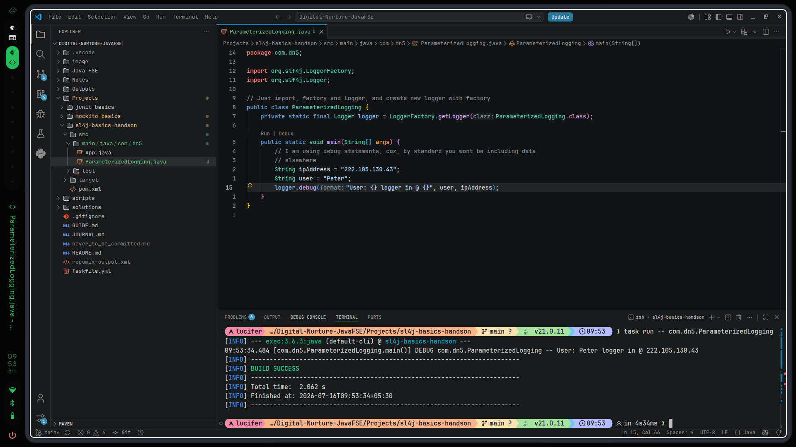

# 16th July, 2026 - 9:55:52 AM

- COmpleted the second exercise
- Refer to - Refer to the [sl4j-basics-handson](../../../Projects/sl4j-basics-handson), the actual code is floating around in there.
---
# Output
