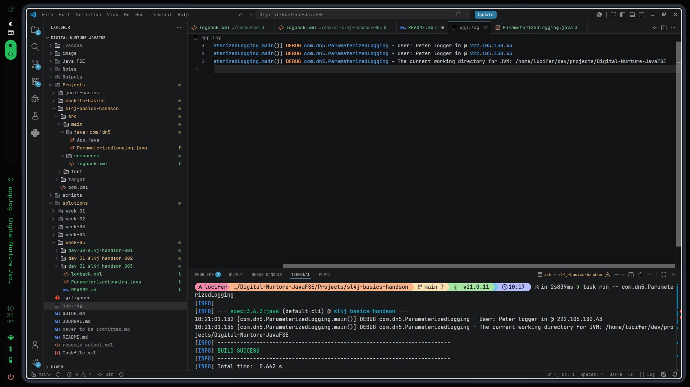

# 16th July, 2026 - 10:22:44 AM
- Done with appenders too
- WEll, the logback.xml thing was new similar to configuration of loggers in python
- And Handlers are here called appenders for obvious reasons

---

# Output:
