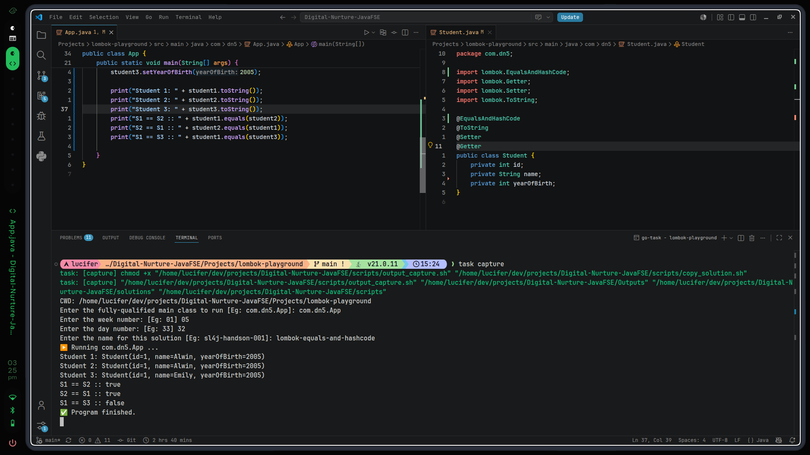

# 17th July, 2026 - 3:25:29 PM

---
- I really need to agree on this one, lombok, is actually shining on this 
- And interestingly, there is also the `Exclude` nested annotation on this too, just like `ToString`. I tested it so dont have to practice it again in here too ...

---
# Output:

---
