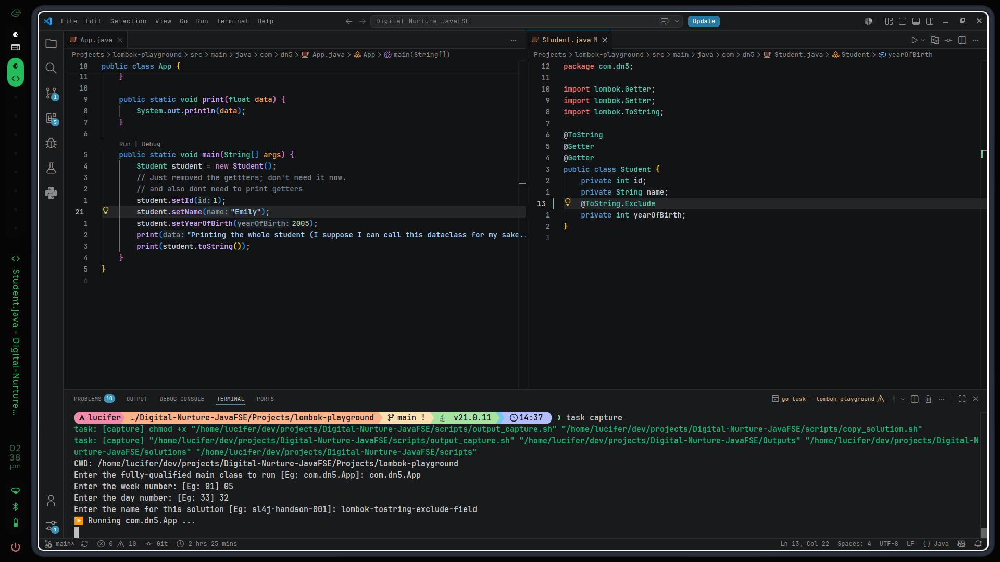

# 17th July, 2026 - 2:38:24 PM

- Just when i had the doubt, chatgpt, mentioned it,
- Such a nice feature to have, because you cant have everything to be shown on the screen as a string aint it?
- And another doubt, what if (hypothetically), I wanted to show the setters/getters generated by lombok, can i do that?

---
# Output:

---
