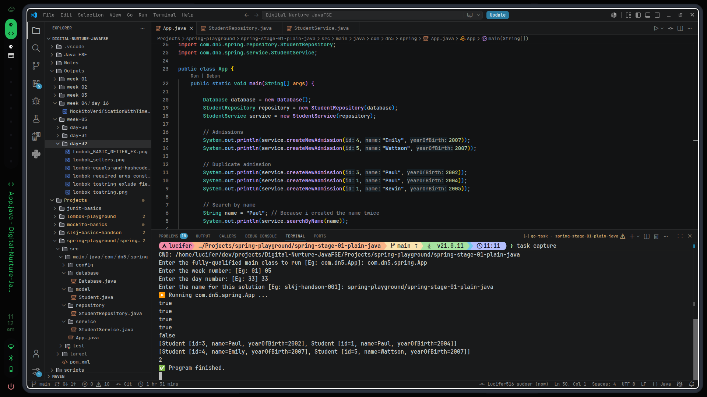

# 18th July, 2026 • 11:12:10 AM

- Really great experience
- Spring eco system is huge, because it evolved, because of real-world problems, really a great trait to admire.
- Spring(core) came into existence, because we where writing too many boiler plates to just create the objects, and also testing was tough, since we created the objects (i suppose we call it high coupling)
- Other than that, next step i supopse will be spring-core

---
# Output:

---
